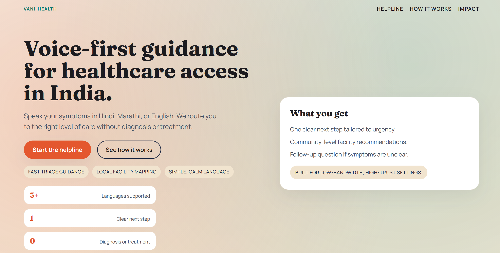
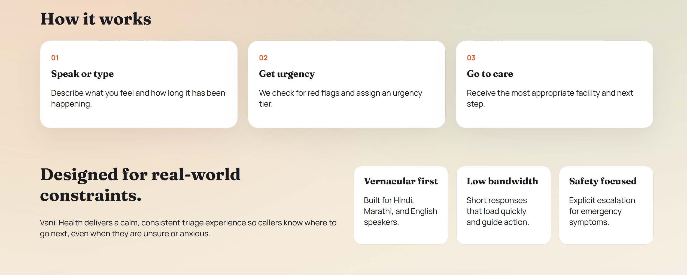
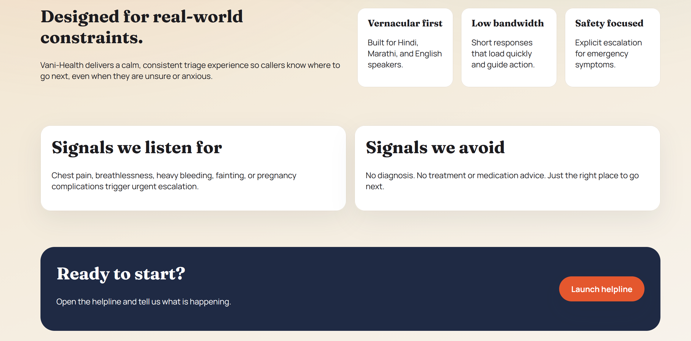

# Vani-Health

**Voice-first healthcare access guidance for India.**



Vani-Health is an AI-powered triage assistant designed to help users in India navigate the healthcare system. It listens to symptoms in vernacular languages (Hindi, Marathi, or English) and provides guidance on the appropriate level of care—without offering a medical diagnosis.

Built for low-bandwidth environments, it focuses on clarity, safety, and speed, routing users to facilities like Primary Health Centres (PHCs) or emergency hospitals based on urgency.

## 🌟 Key Features

* **Voice-First Interface:** Users can speak their concerns naturally using the Web Speech API.
* **Vernacular Support:** Native understanding of **Hindi**, **Marathi**, and **English**.
* **AI Triage:** Powered by **Google Gemini 1.5 Flash** to analyze symptoms against medical guidelines.
* **Safety Guardrails:** Automatically detects red flags (e.g., chest pain, breathing difficulty) for immediate emergency escalation.
* **No Diagnosis:** Strictly avoids medical diagnoses or treatment plans, focusing solely on *where* to go.
* **Responsive Design:** Optimized for mobile and desktop access.

## 📸 How It Works

Vani-Health is designed for real-world constraints, offering a calm and consistent triage experience.



### Safety Signals
We explicitly listen for high-risk symptoms to ensure users get emergency care when needed, while avoiding non-medical advice for general queries.



## 🛠️ Tech Stack

### Frontend
* **Framework:** [Next.js 14](https://nextjs.org/) (App Router)
* **Language:** TypeScript
* **Styling:** Custom CSS with CSS variables
* **Speech Recognition:** Native Browser Web Speech API

### Backend
* **Runtime:** Node.js
* **Framework:** Express.js
* **AI Model:** Google Gemini 1.5 Flash
* **Utilities:** `dotenv`, `cors`

## 🚀 Getting Started

Follow these steps to set up the project locally.

### Prerequisites
* Node.js (v18 or higher recommended)
* npm
* A Google Gemini API Key ([Get one here](https://aistudio.google.com/))

### 1. Clone the Repository
```bash
git clone [https://github.com/addu2612/ekathon.git](https://github.com/addu2612/ekathon.git)
cd ekathon